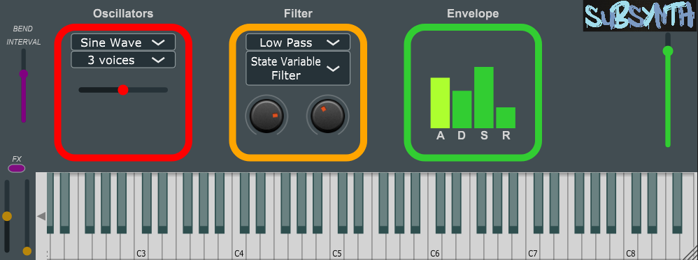

Unzip subsynth.zip and drop it in your VST3 folder to use it.

The SubSynth is a simple subtractive synthesizer with eleven different oscillator voices implemented through Juce.   
The code is divided into the PluginEditor,  the PluginProcessor, the two main objects, and all the other classes controlled by these first two.
The main components of this synthesizer are:
- a Synthesiser class object called mySynth;
- eleven SythesiserSound/SynthesiserVoice class objects;
- a multi-type filter;
- ADSR volume envelope;
- pitch bend;
- four different mod FXs.

Those elements are controlled by :
- the Oscillator GUI (the slider controls the frequency of beats for the last three voices);
- the Envelope GUI;
- the Filter GUI;
- master gain slider in dB, found in the right part of the app;
- a virtual midi keyboard;
- pitch and mod sliders, just next to the midi keyboard;
- pitch bend interval slider;
- mod FX switch button;

From **options** it is possible to acquire external midi inputs.

